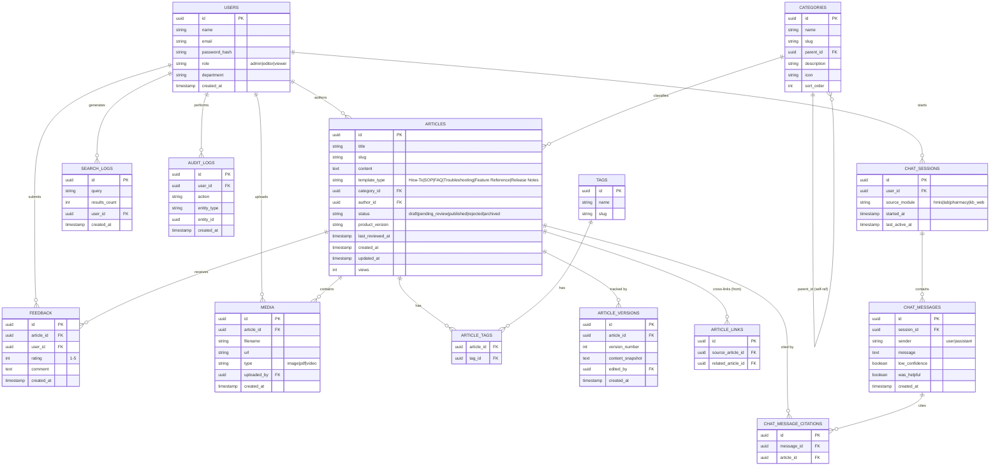

# Entity Relationship Diagram (ERD)

Knowledge Base & HMIS Chatbot System — Week 1 Deliverable

## Diagram

## Notes on Schema Decisions (mapping to requirements)

| Table | Requirements Covered |
|---|---|
| `articles` | FR-1.1, FR-1.2, FR-1.6, FR-1.7, FR-1.8 |
| `article_versions` | FR-1.4 (version history + rollback) |
| `article_links` | FR-1.5 (cross-linking related articles) |
| `categories`, `tags`, `article_tags` | FR-1.5, FR-2.3 |
| `users` | FR-3.1–FR-3.4 (RBAC: admin/editor/viewer) |
| `audit_logs` | FR-3.6 (admin action audit trail) |
| `feedback` | FR-4.1, FR-4.4 |
| `search_logs` | FR-2.6 |
| `chat_sessions`, `chat_messages` | FR-5.7 (multi-turn context), FR-5.10 (was this helpful) |
| `chat_message_citations` | FR-5.3 (citation/link to source article) |

`articles.status` includes `pending_review`/`rejected` to support FR-1.3 (admin review/publish/reject) beyond the original draft/published model. `chat_messages.low_confidence` supports FR-5.9 (admin review of low-confidence questions).
