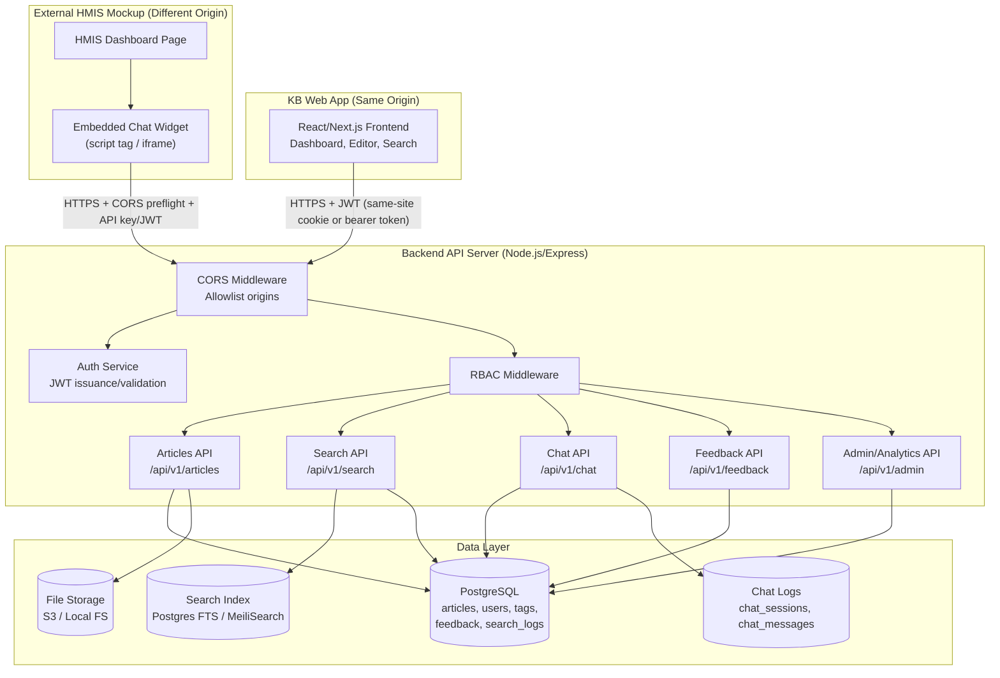
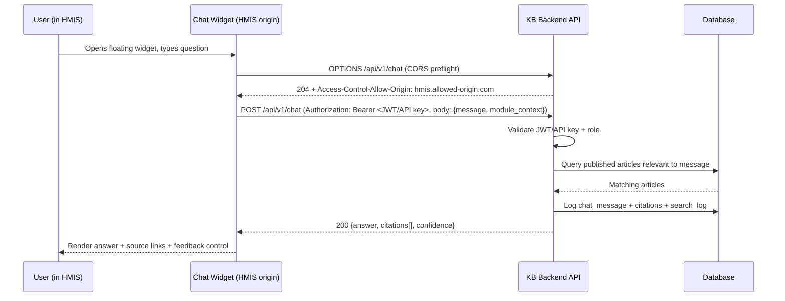

# System Architecture Diagram

Knowledge Base & HMIS Chatbot System — Week 1 Deliverable

## High-Level Architecture

## CORS & Widget Communication Flow

The chatbot widget is embedded into the external HMIS page (a different origin from the KB backend), so every request from the widget to the backend is a cross-origin request and must pass a CORS preflight check.

## CORS Configuration Plan

- The backend maintains an explicit **allowlist** of permitted origins (e.g., the KB web app's own origin and the HMIS mockup's origin) — no wildcard (`*`) origins for authenticated endpoints.
- Preflight (`OPTIONS`) requests are handled for all `/api/v1/*` routes that the widget calls (`/chat`, `/articles` read endpoints, `/feedback`).
- Allowed methods: `GET, POST, OPTIONS`.
- Allowed headers: `Content-Type, Authorization`.
- Credentials: cross-origin requests from the widget use a bearer token/API key in the `Authorization` header rather than cookies, avoiding the need for `Access-Control-Allow-Credentials` complexity.
- Widget-issued tokens are scoped to **read-only / chat-only** permissions distinct from the full editor/admin session tokens used by the KB web app, so a compromised widget token cannot be used to edit or publish content (supports FR-5.4).

## Authentication Strategy

- **KB Web App (Editors/Admins/Viewers):** JWT-based session auth. On login, the server issues a short-lived access token + refresh token; sessions expire after 8 hours of inactivity (FR-3.5).
- **Embedded Widget:** Uses a separate, scoped API key or widget-specific JWT issued per embedding product (HMIS, lab, pharmacy), tied to a role so the chatbot can enforce FR-5.4 (role-based content visibility).
- **Password storage:** bcrypt hashing, never plaintext.
- **RBAC Middleware:** Every protected route checks the decoded token's `role` claim against an allowlist of permitted roles for that route (Viewer / Editor / Admin) before reaching the controller.
- **Audit Logging:** All admin actions (publish, reject, archive, role assignment) are written to `audit_logs` with who/what/when (FR-3.6).
